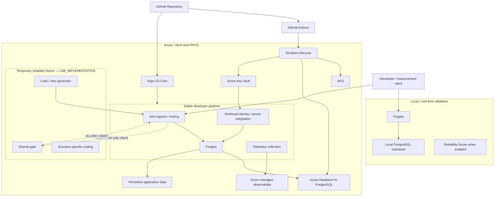

# Architecture

## 1. 목적

이 문서는 프로젝트의 **책임 경계, control-plane ownership, normal request path, reliability experiment path와 decision maturity**를 정의한다.

P0는 future implementation을 무조건 추상화하는 단계가 아니다. 딥인터뷰를 통해 이미 합의된 장기 architecture는 보존하되, 현재 upstream/runtime에 종속되거나 baseline이 필요한 값은 분리한다.

## 2. Decision maturity

Architecture statement는 세 수준으로 구분한다.

### DECIDED

프로젝트 수준에서 이미 합의된 결정이다. 후속 milestone이 구현 편의를 이유로 임의 변경하지 않는다.

### REVALIDATE

방향은 합의됐지만 selected version/region/runtime의 현재 capability를 구현 직전에 다시 확인해야 한다.

### DEFERRED

측정, calibration 또는 실제 environment 정보 없이는 근거 있게 정할 수 없어 아직 고정하지 않는다.

예:

| 항목 | 상태 |
| --- | --- |
| Forgejo 기반 developer platform | DECIDED |
| Forgejo v15 LTS track | DECIDED |
| exact Forgejo patch/chart/image digest | REVALIDATE |
| Azure AKS | DECIDED |
| AKS managed Istio 우선 | DECIDED |
| exact managed Istio revision | REVALIDATE |
| Argo CD Core | DECIDED |
| Terraform bootstrap/foundation/environment lifecycle | DECIDED |
| GitHub Actions → Azure OIDC federation | DECIDED |
| exact GitHub OIDC subject | REVALIDATE |
| inbound active-request capacity mechanism | DECIDED |
| exact Envoy overflow/rejection counter | REVALIDATE |
| Azure node SKU/count | DEFERRED |
| SLO threshold | DEFERRED |
| KEDA scaling threshold | DEFERRED |

## 3. 전체 architecture



이 diagram은 GitHub production topology를 의미하지 않는다.

## 4. Stable developer platform

### Forgejo

DECIDED Core contract:

- Forgejo v15 LTS track
- single replica
- `Recreate` deployment strategy
- external PostgreSQL
- persistent application/repository data
- database-backed session
- bounded `twoqueue` cache
- persistent `level` queue
- SSH Git disabled in Core
- Azure Core는 HTTPS Git 사용
- Forgejo native authentication/authorization 유지
- Actions, Packages, mirroring 등 reliability story에 필요하지 않은 feature는 Core에서 제외
- Forgejo application tier에는 실제 필요가 측정되기 전까지 Redis/Valkey를 별도 dependency로 추가하지 않음. Argo CD Core 같은 control plane의 upstream dependency는 이 금지와 별개다.

Exact v15 patch, Helm chart version과 final image digest는 implementation/evidence 시점에 REVALIDATE한다.

### PostgreSQL

Azure runtime은 Azure Database for PostgreSQL Flexible Server를 기본으로 한다.

- private path 사용
- experiment의 primary bottleneck이 아니어야 함
- PITR는 DB recovery layer이며 coordinated Forgejo backup을 대체하지 않음

Local에서는 disposable PostgreSQL substitute를 사용할 수 있다.

### Storage

Forgejo application/repository data는 database state와 별도의 persistent data boundary를 가진다.

Backup/recovery는 DB와 application data를 함께 다룬다.

## 5. Request path

### Normal path

```text
Developer
→ ingress or local development endpoint
→ Forgejo
→ Forgejo native authentication / authorization
→ PostgreSQL + application data
```

### Reliability experiment path

Reliability fixture가 활성화된 경우에만 mandatory shared check를 추가한다.

```text
Client
→ Istio ingress
→ ext_authz check
→ HAProxy
→ ext-authz-sim Service
→ ext-authz-sim Pod inbound Envoy sidecar
→ ext-authz-sim app
→ ALLOW / DENY
→ original request
→ Forgejo native authentication / authorization
```

DECIDED boundaries:

- shared gate는 Forgejo authentication replacement가 아님
- Git push body 전체를 authz service로 전달하지 않음
- request-check에 필요한 최소 metadata만 사용
- intentional capacity bottleneck은 `ext-authz-sim` Pod inbound Envoy sidecar의 active-request capacity
- HAProxy는 별도 queue/admission/rate-limiting layer

`Sidecar.inboundConnectionPool.http.http2MaxRequests` 사용 방향은 유지하지만, selected Istio/Envoy에서 exact admission/runtime behavior를 P4 revalidation에서 다시 확인한다.

Exact rejection/overflow counter는 version-independent constant로 P0에 고정하지 않는다. Selected proxy의 실제 stat/config inventory가 evidence authority다.

## 6. Scaling contract

Reliability scenario는 다음 두 관점을 비교한다.

- application-container CPU signal을 사용하는 HPA
- proxy/sidecar saturation에 가까운 signal을 사용하는 scaling policy

Azure default scaling integration은 AKS managed KEDA를 우선한다.

Scenario-specific HPA/ScaledObject는 experiment-owned이며 동일 Deployment를 두 controller가 동시에 제어하지 않는다.

Exact KEDA metric과 threshold는 baseline/capability 확인 전에는 DEFERRED다.

## 7. Azure control plane

### Terraform lifecycle

Terraform은 Azure infrastructure lifecycle을 담당한다.

DECIDED stack boundary:

```text
infra/terraform/
├── bootstrap/
├── foundation/
└── environment/
```

책임:

- `bootstrap/`: Terraform state, CI identity/trust, permission-boundary Resource Group/RBAC
- `foundation/`: project DNS, Key Vault, 장기 shared resource/identity 중 필요한 최소 항목
- `environment/`: AKS, PostgreSQL, storage/registry, observability와 paid runtime

`bootstrap/`은 state backend chicken-and-egg 때문에 local state가 허용되는 유일한 stack이다.

Foundation/environment는 remote state를 사용한다.

GitHub Actions → Azure는 long-lived client secret 대신 OIDC/workload federation을 사용한다.

새 repository의 exact immutable OIDC subject와 GitHub Environment protection은 P5 Azure source 구현 직전에 실제 repository 설정을 확인해 고정한다.

### Resource permission boundary

Project CI에 subscription-wide Owner/Contributor/User Access Administrator를 기본값으로 부여하지 않는다.

DECIDED default boundary:

- state blob container: `Storage Blob Data Contributor`
- foundation Resource Group: `Contributor`
- environment Resource Group: `Contributor`
- foundation/environment Resource Group: `Role Based Access Control Administrator`

`Role Based Access Control Administrator`는 privileged role이므로 project-owned Resource Group 밖으로 scope를 넓히지 않는다. Custom role이나 RBAC condition은 실제 필요가 확인되기 전에는 추가하지 않는다. P5 paid-run preflight에서 실제 principal/role/scope inventory를 다시 확인한다.

## 8. AKS managed capability ownership

Azure에서는 self-managed controller를 기본값으로 늘리지 않는다.

DECIDED defaults:

- AKS managed Istio add-on
- AKS managed KEDA
- AKS Key Vault CSI provider
- Microsoft Entra Workload ID

Managed Istio의 exact revision은 chosen AKS version/region에서 실제 available/supported revision을 확인해 선택한다.

P5 preflight에서는 selected revision의 customization surface를 최소 세 범주로 구분한다.

- **supported**: managed support claim 안에서 사용 가능
- **allowed but support-limited**: project experiment에 필요하면 limitation과 runtime evidence를 명시하고 사용 가능
- **blocked/unavailable**: required capability라면 managed default를 조용히 우회하지 않고 fallback ADR을 검토

MeshConfig customization, extension provider, proxy stat exposure와 ingress/routing API는 이 boundary를 current official documentation/runtime에서 다시 확인한다. P4 Local fixture에서 동작한 upstream capability가 곧 Azure managed support를 의미하지 않는다.

필수 capability가 managed Istio의 blocked/unavailable boundary에 걸리는 경우에만 self-managed Istio fallback ADR을 연다.

## 9. GitOps ownership

Argo CD Core를 stable platform reconciliation control plane으로 사용한다.

DECIDED application behavior:

- exact Git revision
- automated sync ON
- self-heal ON
- automatic prune OFF
- narrow source/destination boundary

Argo가 기본적으로 관리하는 대상:

- Forgejo stable namespaced state
- stable routing objects
- workload ServiceAccount/secret integration 같은 project-owned namespaced state
- namespaced telemetry configuration

Argo의 기본 관리 대상이 아닌 것:

- AKS managed Istio/KEDA/Key Vault CSI lifecycle
- managed ingress Deployment/Service
- Argo CD Core 자체 bootstrap
- experiment-owned resource
- cluster-scoped controller를 단순히 "GitOps니까"라는 이유로 추가하는 것

AppProject restriction과 Argo controller의 Kubernetes RBAC는 같은 security boundary가 아니다.

## 10. DNS / TLS / secret boundary

Parent domain은 기존 registrar/DNS authority에 유지하고 project subdomain만 Azure DNS에 delegate한다.

Public TLS automation은 cert-manager + DNS-01을 기본 방향으로 유지하되, exact managed-Istio ingress credential namespace/contract는 Azure implementation preflight에서 다시 확인한다.

Persistent application secret은 Azure Key Vault + Workload Identity + CSI를 우선한다.

Experiment-only secret은 disposable Kubernetes Secret을 사용할 수 있다.

## 11. Observability

Developer operation이 최상위 user signal이다.

Azure Core direction:

- metrics → Azure Managed Prometheus / Azure Monitor Workspace → Managed Grafana
- logs → Log Analytics / Container Insights
- selected tracing → minimal OTel Collector → Application Insights / Azure Monitor

Local에서는 Azure observability stack 전체를 복제하지 않는다. Metric name/unit/label, structured log schema와 correlation boundary만 먼저 고정한다.

Confounder guard는 최소한 다음을 포함한다.

- Forgejo resource/request health
- relevant Forgejo sidecar health
- PostgreSQL CPU/connections/latency/storage
- Kubernetes node CPU/memory/pressure/scheduling

의도한 shared-gate target보다 Forgejo/DB/node가 먼저 포화되면 그 run은 target mechanism의 성공 evidence로 승격하지 않는다.

## 12. Recovery boundary

Forgejo recovery는 PITR 또는 image downgrade 하나로 정의하지 않는다.

Target coordinated flow:

```text
write boundary
→ flush/settle pending work as required
→ graceful stop
→ PostgreSQL backup
→ application-data backup
→ secret/version manifest
→ fresh restore target
→ forgejo doctor
→ developer E2E
```

Upgrade rollback은 필요한 경우 previous compatible state + previous application version + E2E의 조합으로 검증한다.

## 13. SLO boundary

24/7 SaaS가 아니므로 monthly 99.9% 같은 값을 근거 없이 주장하지 않는다.

Service Active Window는 environment가 의도적으로 active/healthy로 선언된 측정 구간이다.

Developer-operation SLI를 사용하고 threshold는 healthy baseline 측정 후 DEFERRED 상태에서 해제한다.

`SLO FAIL`과 `Experiment FAIL`은 같은 의미가 아니다.

## 14. Repository ownership map

아래 map은 최종 책임 경계다. P0에서 빈 directory나 `.gitkeep`을 생성하지 않는다. 실제 capability의 첫 implementation에서 필요한 path만 만든다.

```text
cmd/
└── ext-authz-sim/

internal/
└── ext-authz/

infra/
└── terraform/
    ├── bootstrap/
    ├── foundation/
    └── environment/

platform/
├── local/
├── forgejo/
├── gitops/
├── ingress/
└── telemetry/

operations/
├── slo/
├── alerts/
├── dashboards/
├── runbooks/
└── cost/

tests/
├── integration/
├── e2e/
├── infrastructure/
├── recovery/
└── upgrade/

experiments/
├── fixtures/
│   └── shared-gate/
├── scenarios/
└── load/

results/
└── evidence/

docs/
├── adr/
└── incidents/
```

책임 요약:

| Path | 책임 | 포함하지 않는 것 |
| --- | --- | --- |
| `cmd/`, `internal/` | project-owned custom executable | future speculative services |
| `infra/` | Azure/cloud infrastructure lifecycle | application experiment logic |
| `platform/` | stable developer platform source | temporary fault/load state |
| `operations/` | SLO/alert/dashboard/runbook/cost | deployment ownership 자체 |
| `tests/` | normal-system verification | intentional failure scenario |
| `experiments/` | controlled failure/load hypothesis | stable platform desired state |
| `results/` | reviewed evidence | large raw telemetry |
| `docs/` | human-readable contract/ADR/incident docs | generated manifests |

## 15. Production-minded boundary

Core는 production-minded이지만 production-ready service라고 주장하지 않는다.

Intentional deviations:

- single region
- ephemeral Azure runtime
- Forgejo single replica
- no Forgejo HA
- no multi-region
- fixed node capacity where controlled evidence requires it
- Argo CD Core
- small operator model

이 차이를 evidence와 최종 포트폴리오에서 명시한다.
