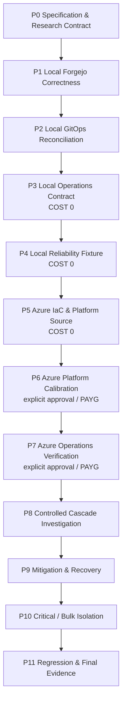

# Roadmap

## 1. 원칙

- milestone은 **검증 가능한 engineering capability/evidence dependency 순서**다.
- P0에서 미래 PR/task 개수까지 고정하지 않는다.
- 각 milestone 진입 시 ChatGPT가 current `main`, previous evidence와 current official upstream/runtime을 딥리서치한 뒤 **그 milestone만** work unit으로 분해한다.
- exact version/SKU/threshold/runtime-dependent metric은 필요한 시점에 다시 검증한다.
- Azure actual provision/destroy는 explicit approval이 필요하다.
- target repository map을 `.gitkeep`으로 미리 만들지 않는다.
- portfolio website, presentation packaging과 personal learning note는 engineering roadmap 밖이다.

## 2. 전체 흐름



핵심 비용 순서:

```text
Local correctness / GitOps / operations / reliability proof
→ Azure source + resource/RBAC/price/quota preflight
→ explicit user approval
→ short-lived Azure calibration / operations verification
→ controlled investigation / mitigation / redesign
→ final regression / teardown
```

## P0 — Specification & Research Contract

**Goal:** 목적, architecture, ownership, dependency, terminology, evidence, safety와 change-management contract 확정.

**Exit:** 문서 간 모순이 없고 executable implementation이 없음.

## P1 — Local Forgejo Correctness

**Goal:** Reliability fixture 없이 실제 Forgejo developer journey 정상화.

**Scope:** current v15 LTS exact implementation pin, disposable local Kubernetes/PostgreSQL, persistent app data, native auth, push/clone/fetch/PR/Issue E2E, workload replacement state continuity.

**Out:** GitOps, full recovery contract, reliability fixture, Azure, SLO threshold.

**Exit:** fresh lifecycle에서 normal developer E2E, state continuity와 cleanup을 실제 확인.

## P2 — Local GitOps Reconciliation

**Goal:** stable Forgejo desired state reconciliation 검증.

**Scope:** Argo CD Core, exact source revision, restricted AppProject/Application, automated sync, self-heal, prune off, controlled drift, post-heal E2E.

**Exit:** controlled drift가 복구되고 developer E2E가 유지됨.

## P3 — Local Operations Contract

**Goal:** fault를 넣기 전에 developer-operation measurement와 recoverability contract를 확립.

**Scope:** structured operation/attempt result, local healthy baseline, metric/log/correlation schema, coordinated backup/restore, `forgejo doctor`, upgrade/state-aware rollback.

**Out:** final Azure SLO threshold, Azure-specific observability implementation.

**Exit:** operation/attempt가 machine-readable하게 구분되고 local recovery/upgrade contract가 실제 proof를 가짐.

## P4 — Local Reliability Fixture

**Goal:** paid Azure 전에 target failure mechanism을 Local에서 통제 가능하게 재현.

**Scope:** `ext-authz-sim`, healthy shared gate, HAProxy, selected upstream Istio/Envoy, inbound active-request saturation, actual selected-runtime rejection signal, bounded retry amplification, confounder guard.

**Exit:** normal/healthy-gate E2E, saturation, selected-runtime signal, retry-attempt 차이, confounder guard와 fixture removal을 검증.

P4 진입 시 current AKS managed Istio 후보와 호환되는 upstream Istio/Envoy 범위를 확인하지만, Azure managed support claim은 P5/P6에서 별도로 재검증한다.

## P5 — Azure IaC & Platform Source

**Goal:** Local에서 확인한 operations/reliability 요구를 Azure infrastructure/platform source로 표현하고 paid apply 전에 정적 검증과 preflight를 끝낸다.

**Scope:** Terraform `bootstrap/foundation/environment` lifecycle, remote-state/OIDC/RBAC source, DNS/Key Vault, network/private PostgreSQL/storage/registry, AKS managed capabilities, stable Forgejo/GitOps/routing/secret/observability source, cost/quota/RBAC/destroy preflight.

**Exit:** static validation + planned resource/RBAC/cost/cleanup inventory와 managed-capability support boundary가 리뷰 가능.

**Cost:** Azure side effect 없음.

## P6 — Azure Platform Calibration

**Entry:** P5 preflight + P4 mechanism proof + current price/quota/region/RBAC + exact source commit + explicit approval.

**Goal:** 실제 Azure에서 state/OIDC/RBAC, AKS/private PostgreSQL/managed add-ons/Argo/HTTPS developer path와 headroom/cost를 짧게 검증.

**Exit:** platform calibration과 actual runtime provenance가 기록됨. 같은 승인 범위에서 P7을 바로 수행하지 않으면 same-day destroy.

## P7 — Azure Operations Verification

**Goal:** 실제 Azure에서 observability, developer SLI baseline, SLO threshold, restore, upgrade/state-aware rollback contract를 검증.

**Scope:** selected metrics/logs/traces query path, developer-operation correlation, recovery drill, upgrade/rollback, P8에 필요한 mechanism signal visibility.

**Exit:** P8 controlled incident를 user impact부터 mechanism까지 설명할 운영 evidence path가 준비됨.

## P8 — Controlled Cascade Investigation

**Goal:** Developer impact → failure mechanism을 설명 가능한 controlled incident를 생성하고 incident record를 남긴다.

Progression 예시는 해당 milestone deep research에서 다시 확정하되 최소한 다음을 구분한다.

1. healthy baseline
2. healthy shared gate
3. target active-request saturation
4. scaling-signal mismatch
5. bounded retry
6. retry attempt 증가와 shared-path pressure

Valid run에는 **Developer impact / Failure mechanism / Confounder guard**가 모두 필요하다.

**Exit:** controlled incident evidence와 초기 incident/postmortem record가 존재.

## P9 — Mitigation & Recovery

**Goal:** 같은 workload/fault boundary에서 retry/backoff, overload protection, scaling 등의 trade-off를 비교하고 continuing demand 중 recovery를 측정.

같은 Deployment를 HPA와 KEDA가 동시에 제어하지 않는다. Exact mitigation matrix는 P9 진입 시 evidence와 current runtime을 보고 확정한다.

**Exit:** mitigation 비교, recovery criterion/time과 postmortem corrective action이 evidence로 연결됨.

## P10 — Critical / Bulk Isolation

**Goal:** interactive developer traffic과 automation/bulk traffic의 capacity/blast radius 분리.

기본 방향은 같은 application behavior를 유지하면서 critical/bulk capacity pool 또는 admission boundary를 분리하는 것이다. Exact topology는 P10 진입 시 P8/P9 evidence를 보고 확정한다.

**Exit:** isolation 전후 critical developer SLI와 bulk degradation/shedding 차이를 비교할 수 있음.

## P11 — Regression & Final Evidence

**Goal:** 같은 failure class의 재도입을 잡는 cost-free regression gate와 final controlled engineering evidence를 확정하고 Azure lifecycle을 finalization한다.

**Scope:** final source/runtime provenance, selected controlled repetitions, reviewed evidence index, regression verification, final Azure teardown, residual resource/cost inventory.

Controlled repetition 수는 P11 진입 시 cost/runtime과 evidence quality를 보고 확정한다. 반복 횟수만으로 statistical significance를 주장하지 않는다.

**Exit:** engineering claim이 reviewed evidence까지 추적 가능하고 paid resource lifecycle이 종료됨.

## 3. Roadmap 밖

다음은 이 repository의 engineering roadmap에 넣지 않는다.

- portfolio website source와 UI
- résumé/interview-facing copy
- presentation/demo time script
- personal learning notes

Engineering artifact인 architecture/ADR/runbook/incident/postmortem/reviewed evidence는 portfolio에서 재사용될 수 있어도 이 repository에서 자체 목적과 lifecycle을 가진다.
