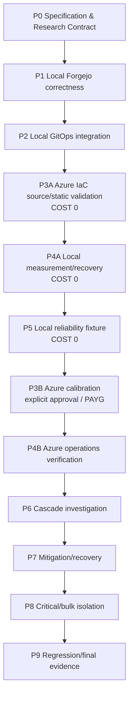

# Roadmap

## 1. 원칙

- milestone은 검증 가능한 capability/evidence dependency 순서다.
- detailed implementation은 해당 work unit 시작 전에 ChatGPT가 별도로 확정한다.
- exact version/SKU/threshold/runtime-dependent metric은 필요한 시점에 current upstream/runtime에서 재검증한다.
- Azure actual provision/destroy는 explicit approval이 필요하다.
- target repository map을 `.gitkeep`으로 미리 만들지 않는다.

## 2. 전체 흐름



핵심 비용 순서:

```text
P3A static source
→ P4A Local
→ P5 Local
→ Azure resource/RBAC/price/quota preflight
→ user approval
→ P3B Azure
```

## P0 — Specification & Research Contract

**Goal:** 목적, architecture, ownership, dependency, terminology, evidence, safety와 change-management contract 확정.

**Exit:** 문서 간 모순이 없고 executable implementation이 없음.

## P1 — Local Forgejo correctness

**Goal:** Reliability fixture 없이 실제 Forgejo developer journey 정상화.

**Scope:** current v15 LTS exact implementation pin, disposable local Kubernetes/PostgreSQL, persistent app data, native auth, push/clone/fetch/PR/Issue E2E.

**Out:** Azure, GitOps, reliability fixture, SLO threshold, full recovery contract.

**Exit:** fresh lifecycle에서 normal developer E2E와 cleanup을 실제 확인.

## P2 — Local GitOps integration

**Goal:** Stable Forgejo desired state reconciliation 검증.

**Scope:** Argo CD Core, exact source revision, restricted AppProject/Application, automated sync, self-heal, prune off, controlled drift, post-heal E2E.

**Exit:** drift가 복구되고 developer E2E가 유지됨.

## P3A — Azure IaC source/static validation

**Goal:** Azure 비용 전에 lifecycle/identity/network/managed capability/platform source와 paid apply preflight 완성.

**Exit:** static validation + resource/RBAC/cost/cleanup inventory가 리뷰 가능.

**Cost:** Azure side effect 없음.

## P4A — Local measurement/recovery

**Goal:** fault 전에 developer measurement와 recoverability contract 확립.

**Scope:** structured operation/attempt result, baseline, local instrumentation schema, coordinated backup/restore, upgrade/state-aware rollback.

**Exit:** operation/attempt가 machine-readable하게 구분되고 recovery contract가 실제 proof를 가짐.

## P5 — Local reliability fixture

**Goal:** paid Azure 전에 target mechanism을 Local에서 재현.

**Scope:** `ext-authz-sim`, healthy shared gate, HAProxy, inbound Envoy active-request saturation, actual rejection signal, retry amplification, confounder guard.

**Exit:** normal/healthy-gate E2E, saturation, exact selected-runtime signal, retry attempt 차이, confounder guard, fixture removal을 검증.

## P3B — Azure calibration

**Entry:** P3A preflight + P5 mechanism + current price/quota/region/RBAC + exact source commit + explicit approval.

**Goal:** remote state/OIDC, AKS/private PostgreSQL/managed add-ons/Argo/HTTPS developer path와 실제 headroom/cost를 짧게 검증.

**Exit:** calibration 기록 후 paid environment 정리.

## P4B — Azure operations verification

**Goal:** Azure observability, SLO baseline, restore, upgrade/rollback contract 검증.

## P6 — Cascade investigation

**Goal:** Developer impact → failure mechanism을 설명 가능한 controlled incident 생성.

Progression:

1. healthy baseline
2. healthy shared gate
3. inbound Envoy request-capacity saturation
4. application-container CPU scaling mismatch
5. bounded retry
6. retry attempt 증가 + HAProxy/Envoy pressure

Valid run에는 Developer impact / Failure mechanism / Confounder guard가 모두 필요하다.

## P7 — Mitigation and recovery

**Goal:** 같은 workload/fault boundary에서 retry/backoff, overload protection, scaling을 비교하고 continuing demand 중 recovery를 측정.

HPA와 KEDA가 같은 Deployment를 동시에 제어하지 않는다.

## P8 — Critical / bulk isolation

**Goal:** interactive developer traffic과 automation/bulk traffic의 capacity/blast radius 분리.

기본 redesign은 HAProxy classification을 통해 critical/bulk capacity pool을 분리하고 같은 `ext-authz-sim` image를 사용한다. Bulk degradation/shedding과 critical developer SLI를 별도로 측정한다.

## P9 — Regression and final evidence

**Goal:** cost-free regression gate, final controlled evidence와 Azure finalization.

Final comparison은 기본 **3 controlled repetitions**을 계획한다. Statistical significance를 주장한다는 뜻은 아니다.
